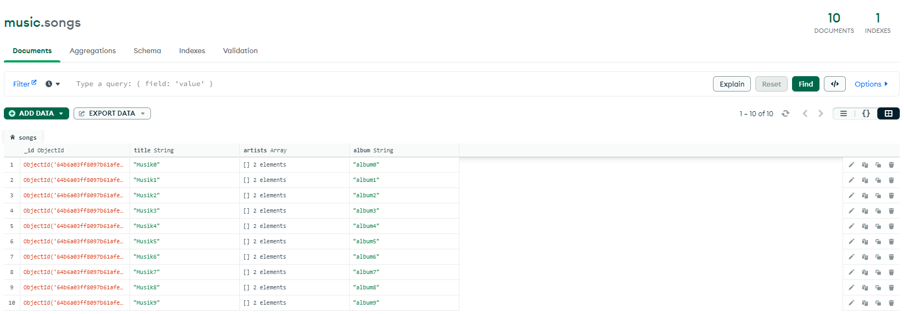
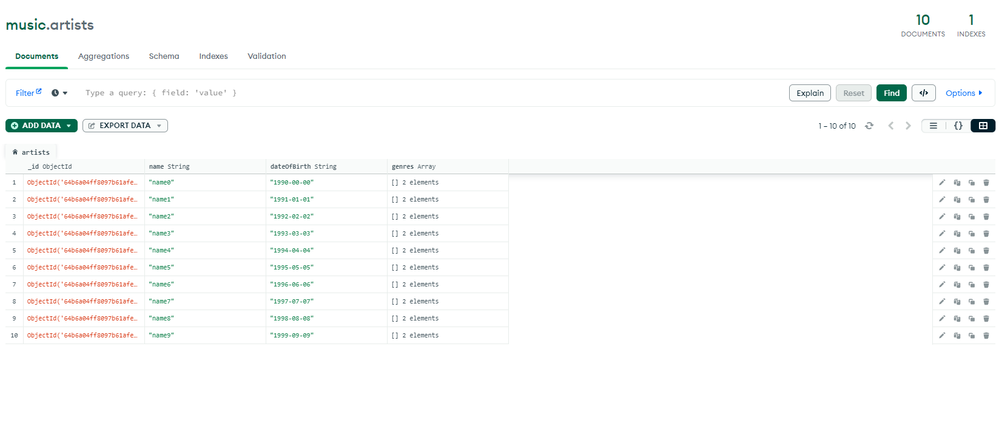
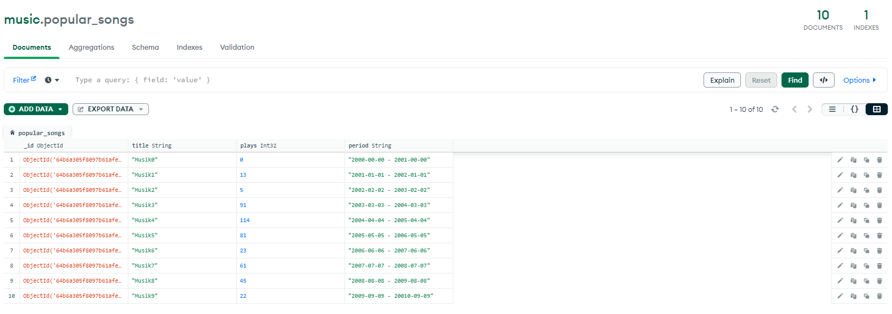

# Homework Module 3.1
 MongoDB exercise
 
Instruction

1. Create a database that stores the following information:

- Songs, containing the following data: the title of the song, the name of the artist(s), and the album

- Artists, containing the following data: name, date of birth, genre(s)

- Popular Songs, containing the following data: the title of the song, how many times it’s played, period of time

2. Populate the database you’ve created above with at least 10 data for each collection

